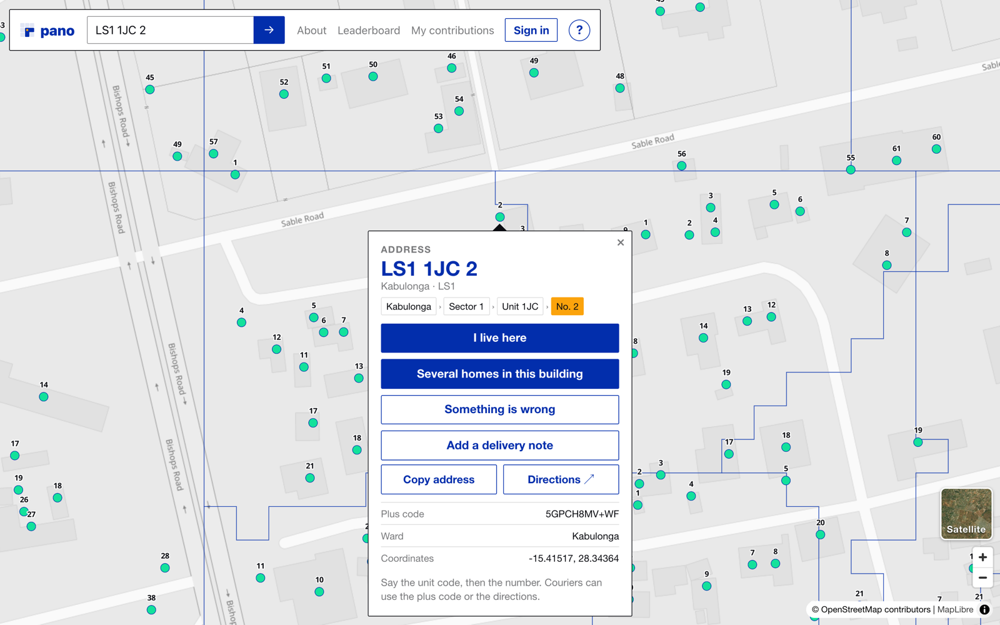
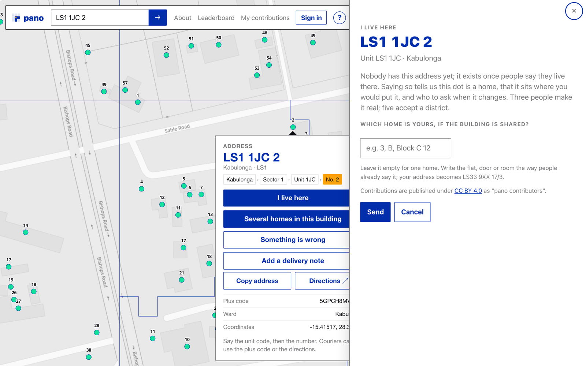
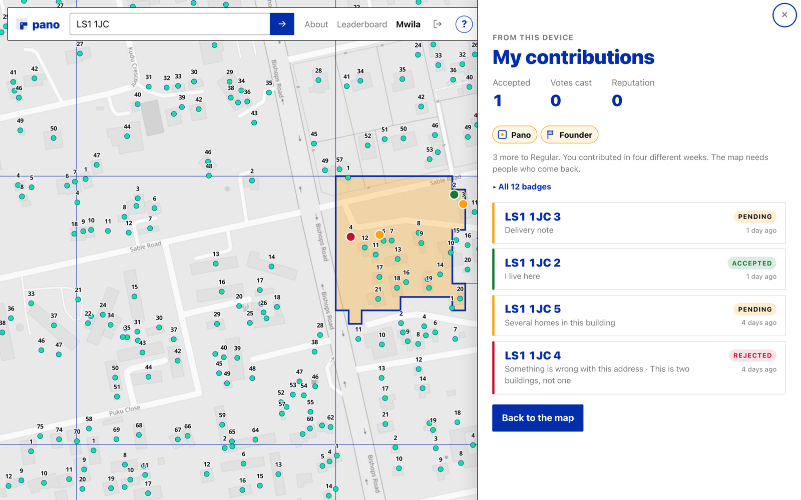
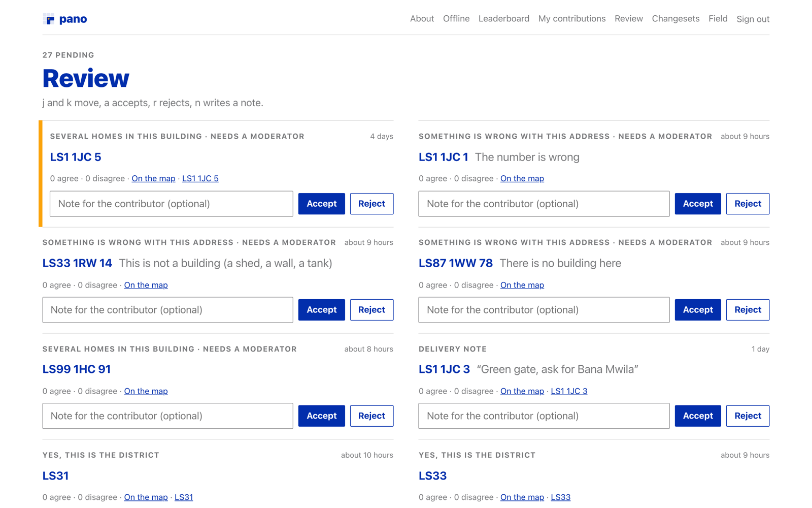
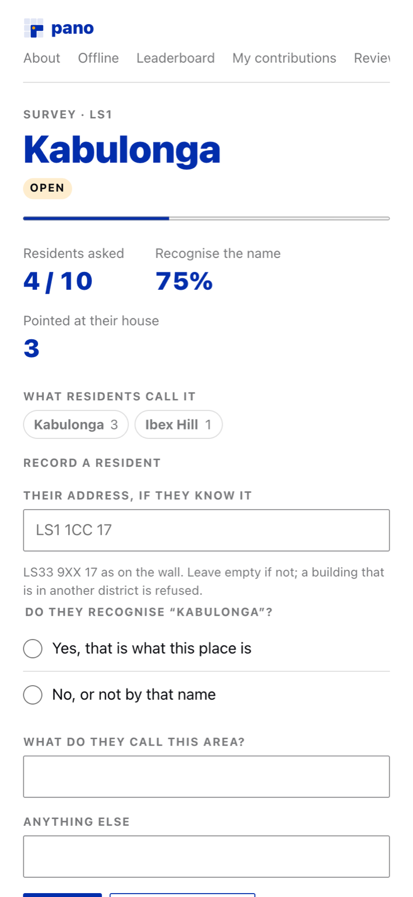

<p align="center"><br>Where people improve <a href="https://github.com/0x1za/pano">pano</a>, the addressing scheme for Lusaka.</p>

The Rust side of pano draws fifty districts and eleven thousand units
from buildings, boundaries and barriers. It cannot tell whether anyone
calls Kabulonga "Kabulonga", whether the dot at `LS1 1JC 2` is a home or a
shed, or that the block behind the green gate holds four families. Only
people can. This is where they say so.



Anyone with the map open can say they live at an address, describe the
homes inside a shared building, report that something is wrong, or leave
a note for the courier. Contributions are voted on or reviewed, batched
into changesets, and read by the next gazetteer cut; the churn that cut
causes comes back to the changeset page. Nobody has to sign in, and the
whole thing works on a phone with patchy data.

Rails 8.1, SQLite, Solid Queue, importmap, Hotwire, Rails 8 auth, one
hand-written stylesheet, minitest. In the style of span. The plan it
follows is [`docs/contributions-plan.md`](https://github.com/0x1za/pano/blob/main/docs/contributions-plan.md)
in the pano repository; all six phases are built.

## What people can do

| On the map | Kind | Becomes real when |
|---|---|---|
| **I live here**, and which home if the building is shared (`LS1 1JC 2/3`) | `confirm_address` | 3 people agree |
| **Several homes in this building**: how many, and what the doors are called | `multi_occupancy` | a moderator accepts |
| **Something is wrong**: not here, not a building, two buildings, wrong number | `dispute_address` | a moderator accepts |
| **Add a delivery note**: "green gate, ask for Bana Mwila", with a photo | `delivery_note` | 1 person agrees, or 30 days pass unopposed |
| **Yes, this is the district**, at city zoom | `confirm_district` | 5 people agree, or a moderator |
| A building the map does not have | `missing_building` | a moderator; it takes the next free number in its unit |
| These cells belong to the other unit | `boundary_move` | a moderator, and only into a changeset |

Two kinds from the plan are retired. Districts are not renamed by
residents, because their names come from the seeds and the government
overlays; residents confirm or dispute, moderators edit. Units are not
named, because the places that have names already have them on other
maps. What the map needs from people is who lives where and how many
homes a dot really is.



Your own contributions sit on the map as pins coloured by status, and
the panel lists them with the reason if one was rejected. Badges are in
the map's own vocabulary: Pano for an accepted "I live here", then
Street, Block and Compound at ten, fifty and two hundred acceptances,
and marks for the things the map needs people for. Nothing earned
changes what anyone may do.



Search takes a pano code, a district name, or the address you already
have. "Chila Road, Kabulonga" goes to a Photon geocoder bounded to
Lusaka and lands you on the street; then you tap your house. The old
address is how you find the building, the pano code is what you leave
with. A Satellite toggle sits in the corner for the compounds where the
base map is a grey blur.

## How it reaches the map



The Rust side stays the source of truth for what a code means. This app
imports a published gazetteer directory (refusing it, like the Rust
reader, unless every file matches `SHA256SUMS`), asks the pano API for
lookups (cached on the gazetteer `ETag`), and exports what people said
as one file that zoning reads next to `seeds.toml`:

```json
{
  "gazetteer": "0.1.0",
  "generated_by": "<gazetteer hash>",
  "names": {},
  "seeds": [],
  "buildings": [ { "lat": -15.4032, "lng": 28.2234, "note": "new house, 2026" } ],
  "sub_addresses": { "LS1 1JC 17": ["3", "B"] },
  "disputed_cells": [ { "cell": "5GPCH6WF+", "from": "LS3 1RQ", "to": "LS13 1CC" } ]
}
```

`/changesets` (moderators) drafts one from everything accepted and
unassigned, a nightly job keeps the draft current, and export freezes it.
Then, in the pano repository and back here:

```
aspect zone -- --changes changes.json --version 0.2.0
aspect validate -- --gazetteer gazetteer/v0.2.0
aspect diff -- gazetteer/v0.1.0 gazetteer/v0.2.0 --json > churn.json
bin/rails "pano:applied[CHANGESET_ID,0.2.0,churn.json]"
```

Places and buildings are imported per gazetteer version and never
edited. A contribution points at a code, not a row, so it survives a
re-cut and the diff can say what became of it.

## A contribution's life



Anyone can agree or disagree with a pending contribution, once per
device and once per account, never with their own. The rules that turn
votes into acceptance are one pure module, `Acceptance`, with a table
test; votes only ever accept, and the kinds the plan reserves for
moderators wait for one. One open contribution per device or account
per kind and place; one home per person, so a new "I live here" moves
the last one rather than adding a vote.

Accounts are optional. Signing in or up claims the device and everything
it contributed, so one person voting from two phones is still one vote.
Signups open with the `:signups` flag. Roles are contributor, moderator
and admin; reputation is a counter that only changes who is asked first.



- `/review`, moderators: `j` and `k` move, `a` accepts, `r` rejects,
  `n` writes a note for the contributor.
- `/avo` and `/flipper`, admins: the back office and the flags. Both
  404 for anyone else.

## Field protocol

The PoC question is whether residents recognise the districts as the
city in their heads, and no amount of tapping answers it. `/surveys`
(moderators) is the protocol as a flow: open a survey on one district,
ask ten residents the same two things in person, and record what they
said. Do you recognise this name? What do you call this place? Their
address, if they know it.

<p align="center"></p>

Answers are evidence for the maintainers, not votes: the page shows the
recognition rate and a tally of the names heard, folded across
spellings, to read before touching `seeds.toml`. A resident who also
points at their own building, and agrees it sits in the district, becomes
a `hand-verified` conformance vector; the survey page downloads the
file in the shape `fixtures/conformance/*.json` uses on the Rust side,
cells fetched from the pano API. The Rust harness loads such a file and
fails when a cell is wrong.

## Photos

A delivery note, a problem report or a shared-building description may
carry one photo. `PhotoUpload` sniffs the bytes, re-encodes the image
through libvips with every metadata block dropped (EXIF including GPS,
XMP, IPTC, ICC) and scales it to fit 1600 px before Active Storage ever
sees it, so a gate photo cannot carry a household's location or a
phone's identity. The author and moderators see it; everyone else only
once the contribution is accepted. Development and test store on disk;
production needs the object-storage block in `config/storage.yml`.

## Offline

Kanyama does not have data everywhere. `/offline` is a text-only form,
cached by the service worker, for an address the person already knows:
say you live there, leave a note, or report a problem. Entries go to an
IndexedDB outbox with a client-minted mutation id and replay through
`POST /sync/push` when the phone is back online, and every thirty
seconds after that. `SyncApplier` applies each once on (device,
mutation id) and answers per mutation; what it refuses stays on the
phone with the reason. The map bar shows how many are waiting. Offline
map tiles wait on the Rust side's PMTiles work.

## Identity, abuse, privacy

- A device token in a signed cookie identifies an anonymous contributor;
  rack-attack throttles contributions at 60 an hour per device and 300
  per address, geocoding at 120 per address, sync at 60 per device.
- Nothing identifies a household. A note is attached to a building, not
  a person; "ask for …" notes are moderated; phone numbers are not
  collected.
- Contributions are published under CC BY 4.0 as "pano contributors",
  independent of OpenStreetMap, so the share-alike question stays
  confined to the barrier weights on the Rust side.

## Layout

```
app/models/contribution.rb     kinds, statuses, one-home and one-open rules, sub-addresses
app/models/acceptance.rb       pure: votes → accepted, table-tested
app/models/badges.rb           pure: the ladder and the marks
app/models/changeset.rb        draft, gather, export changes.json, record churn
app/models/survey.rb           the field protocol, with survey_response.rb
app/services/gazetteer_import.rb   hash-verifying import of a gazetteer directory
app/services/sync_applier.rb       idempotent replay of the offline outbox
app/services/field_fixture.rb      survey → hand-verified conformance vectors
app/lib/pano_api.rb            the pano API, cached on ETag
app/lib/geocoder.rb            Photon proxy, bounded to Lusaka
app/lib/photo_upload.rb        vips re-encode, metadata dropped
app/javascript/controllers/    map, modal (side panel), review keys, outbox, offline form
app/javascript/sync/           IndexedDB outbox and the sync client
app/views/pwa/service-worker.js
config/recurring.yml           nightly settle and changeset draft
lib/tasks/pano.rake            pano:import, pano:applied
docs/                          logo, diagrams (Mermaid sources and SVGs), screenshots
scripts/                       diagrams.sh, screenshots.sh
```

## Run it

```
bin/setup
bin/rails "pano:import[../pano/gazetteer/v0.1.0]"    # a published gazetteer directory
PANO_API_URL=http://127.0.0.1:8080 bin/dev            # the pano API must be running
```

Then open http://localhost:3000. Optional: `PANO_GEOCODER_URL` for a
Photon-compatible endpoint (default `photon.komoot.io`) and
`PANO_SATELLITE_TILES` for a raster tile template (default Esri World
Imagery, fine for a pilot with attribution, keyed for production).

To make the first admin:

```
bin/rails runner 'User.find_by!(email_address: "you@example.com").role_admin!'
```

## Development

`bin/rails test`, `bin/rubocop`, `bin/brakeman`. `lefthook install` wires
the hooks. `/styleguide` renders every CSS primitive. System tests run at
a phone viewport, because the contributors are on phones.

`scripts/diagrams.sh` re-renders `docs/diagrams/*.mmd` to SVG;
`scripts/screenshots.sh` retakes the screenshots from a running dev
server (the signed-in ones need a moderator's `SHOT_EMAIL`,
`SHOT_PASSWORD` and a `SHOT_SURVEY` id). The logo is pano's mark with a
second amber building: the one a resident added.

## Licence

Code: Apache-2.0 (`LICENSE`). Contributions: CC BY 4.0, attributed to
"pano contributors". The specification the codes follow is
[`SPEC.md`](https://github.com/0x1za/pano/blob/main/SPEC.md) in the pano
repository, CC BY 4.0.
